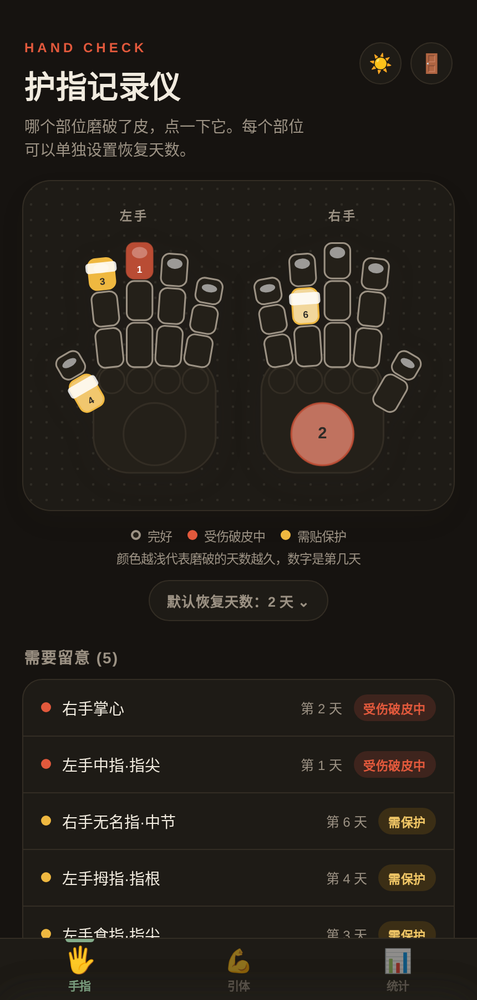
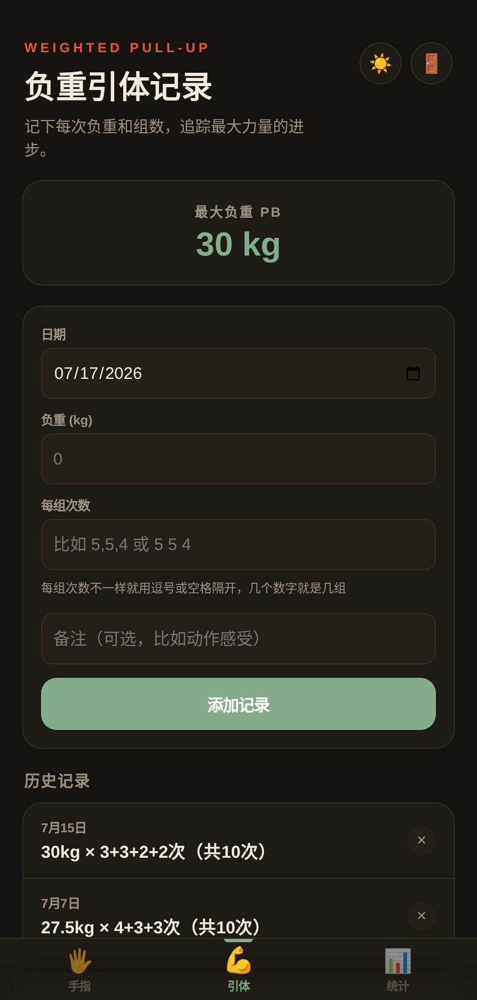
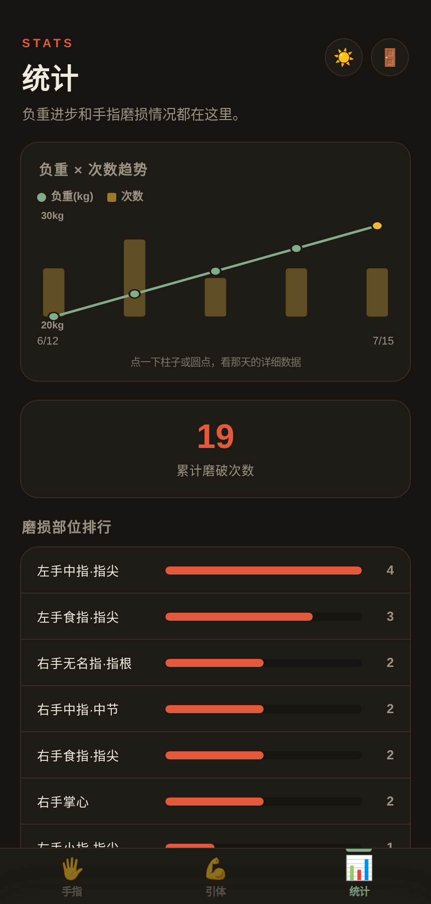

# 攀

一个给攀岩用的私人小工具：记手指磨损、记负重引体、看数据趋势。三个标签页，纯网页，可以加到 iPhone 主屏幕当 App 用。

---

## 截图

### 手指
点哪个部位磨破了皮，颜色会随天数变浅，数字是第几天。每根手指分成指尖/中节/指根，手掌是掌心+四指根部，一共约30个可点部位，每个都能单独设置恢复天数。



### 引体
记录负重、每组次数（支持不均等，比如 4+4+3），自动算出单次最大负重 PB。



### 统计
负重×次数趋势图（点柱子/圆点看当天详情），累计磨破次数，磨损部位排行。



---

## 功能一览

| 标签 | 功能 |
|---|---|
| 🖐️ 手指 | 点选受伤部位记录时间；恢复阈值可全局设默认值，也可给单个部位单独设置（1-7天）；恢复中的部位会显示第几天，颜色随天数变浅；超过恢复阈值自动提示"需保护" |
| 💪 引体 | 记录日期/负重/每组次数/备注；显示最大负重PB；历史记录分页显示 |
| 📊 统计 | 负重×次数趋势图（可点击查看当天详情）；累计磨破次数；各部位磨损排行 |

右上角🌙/☀️可以切换深色/浅色主题，默认深色。


---

## 云同步（InstantDB）

这个 App 接了 [InstantDB](https://instantdb.com) 做云端同步，邮箱验证码登录。


### 需要你在 InstantDB 后台做一步配置

打开 InstantDB 控制台 → 对应的 app → **Permissions**，粘贴：

```json
{
  "appState": {
    "allow": {
      "view": "auth.email == 'xxx@gmail.com'",
      "create": "auth.email == 'xxx@gmail.com'",
      "update": "auth.email == 'xxx@gmail.com'",
      "delete": "auth.email == 'xxx@gmail.com'"
    }
  }
}
```

